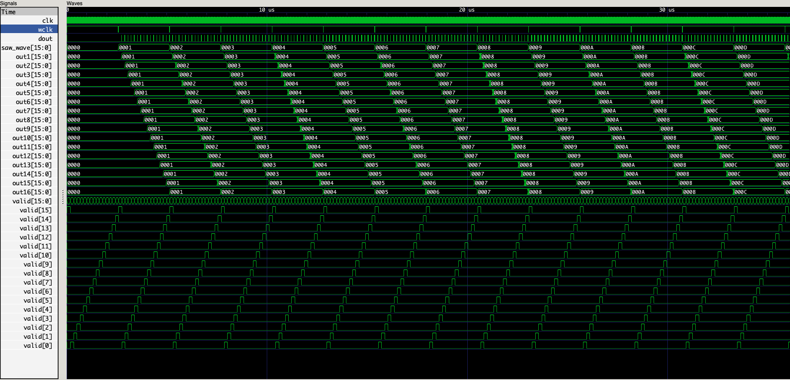

# encode and decode tdm time-division-multiplex digital audio signals 
decode and decode 16-ch/ 16 bits-per-sample TDM audio stream

* Using [ghdl](https://github.com/ghdl/ghdl) tool chain

# ghdl
```
ghdl -a --ieee=synopsys -fexplicit TDM_decoder.vhdl
ghdl -a --ieee=synopsys -fexplicit TDM_encoder.vhdl
ghdl -a --ieee=synopsys -fexplicit counter_tb.vhdl
ghdl -r counter_tb --stop-time=3250ns --vcd=wave.vcd
```

# view VCD output file in GTKWave

